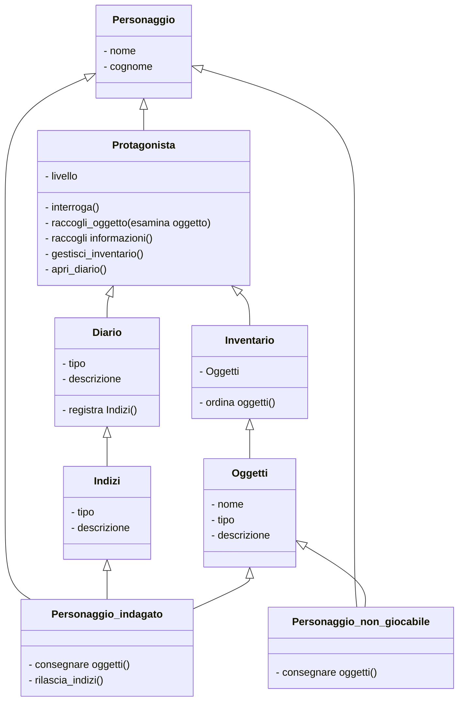

```mermaid
classDiagram
Personaggio <|-- Protagonista
Personaggio <|-- Personaggio_non_giocabile
Personaggio <|-- Personaggio_indagato
Protagonista <|-- Diario
Protagonista <|-- Inventario


Diario <|-- Indizi
Indizi <|-- Personaggio_indagato
Inventario <|-- Oggetti
Oggetti <|-- Personaggio_non_giocabile
Oggetti <|-- Personaggio_indagato
   
    class Personaggio{
        - nome
        - cognome
    }


    class Protagonista{
      - livello


      - interroga()
      - raccogli_oggetto(esamina oggetto)
      - raccogli informazioni()
      - gestisci_inventario()
      - apri_diario()
     
    }


    class Personaggio_non_giocabile{
    - consegnare oggetti()
    }


    class Personaggio_indagato{
      - consegnare oggetti()
      - rilascia_indizi()


    }


    class Inventario{
        - Oggetti
        - ordina oggetti()
    }


    class Oggetti{
        - nome
        - tipo
        - descrizione
    }


    class Indizi{
        - tipo
        - descrizione
    }


      class Diario{
        - tipo
        - descrizione
        - registra Indizi()
    }

```