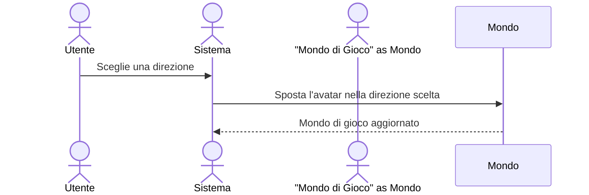
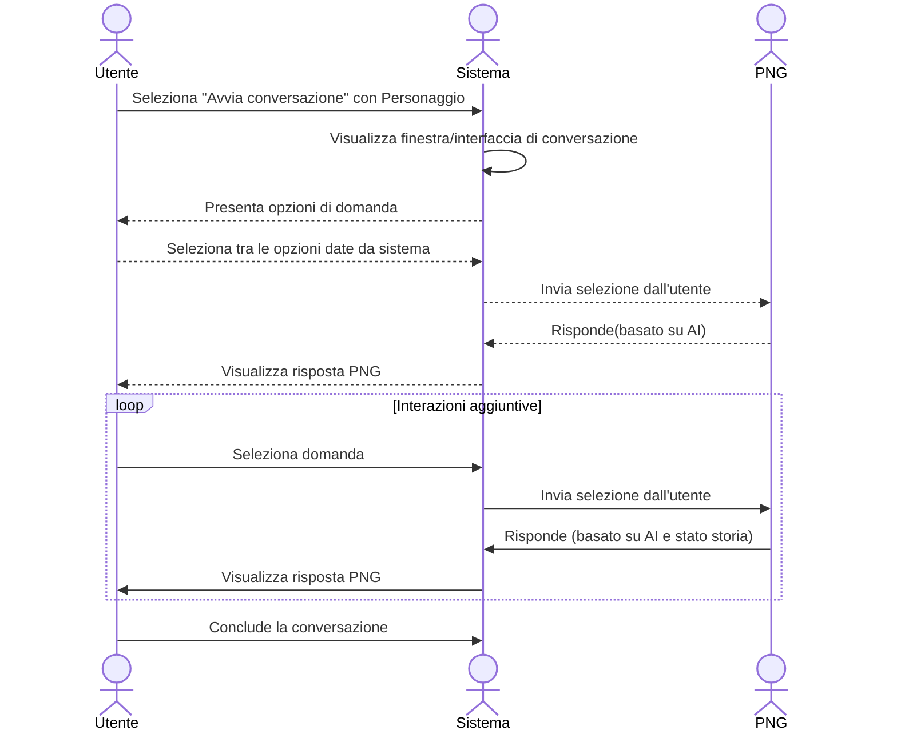
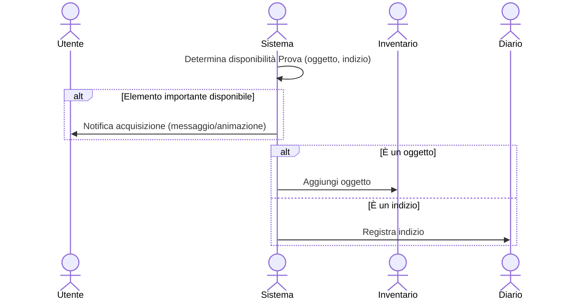

**CASO D'USO 1, INTERAGIRE CON GLI ELEMENTI E I PERSONAGGI DEL GIOCO:**

**CASO D'USO 2, RACCOLTA DI INDIZI, OGGETTI E DICHIARAZIONI:**

**CASO D'USO 3, EFFETTUARE SCELTE PER SBLOCCARE PERCORSI ALTERNATIVI:**
